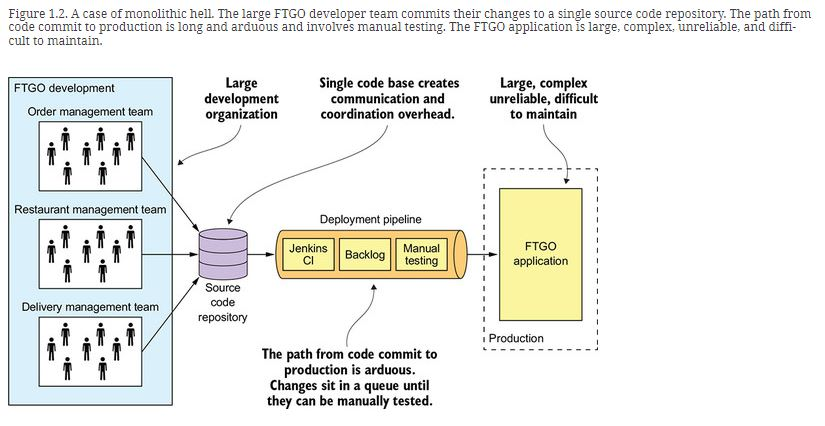

# 1. The benefits of the monolithic architecture

* Simple to develop—IDEs and other developer tools are focused on building a single application.
* Easy to make radical changes to the application—You can change the code and the database schema, build, and deploy.
* Straightforward to test—The developers wrote end-to-end tests that launched the application, invoked the REST API, and tested the UI with Selenium.
* Straightforward to deploy—All a developer had to do was copy the WAR file to a server that had Tomcat installed.
* Easy to scale—Ran multiple instances of the application behind a load balancer.

# 2. Living in monolithic

#### COMPLEXITY INTIMIDATES DEVELOPERS

+ It’s too large for any developer to fully understand => fixing bugs and correctly implementing new features have become difficult and time consuming. Deadlines are missed.
+ To make matters worse, this overwhelming complexity tends to be a downward spiral. If the code base is difficult to understand,
  a developer won’t make changes correctly. Each change makes the code base incrementally more complex and harder to understand

#### DEVELOPMENT IS SLOW

+ The large application overloads and slows down a developer’s IDE
+ Building application takes a long time
+ The application takes a long time to start up

#### PATH FROM COMMIT TO DEPLOYMENT IS LONG AND ARDUOUS

+ Can't deploy changes to production many times a day during business hours.
+ So many developers committing to the same code base, so complex and the impact of a change
  => testing takes a long time

#### SCALING IS DIFFICULT

#### DELIVERING A RELIABLE MONOLITH IS CHALLENGING

+ The lack of reliability, cause testing the application thoroughly is difficult, due to its large size

#### LOCKED INTO INCREASINGLY OBSOLETE TECHNOLOGY STACK

+ The monolithic architecture makes it difficult to adopt new frameworks and languages
+ It would be extremely expensive and risky to rewrite the entire monolithic application so that it would use a new and presumably better technology.
  => Consequently, developers are stuck with the technology choices they made at the start of the project

# 3. Let's discuss together to achieve

* The essential characteristics of the microservice architecture, its benefits and drawbacks, and when to use it
* Distributed data management patterns
* Effective microservice testing strategies
* Deployment options for microservices
* Strategies for refactoring a monolithic application into a microservice architecture
