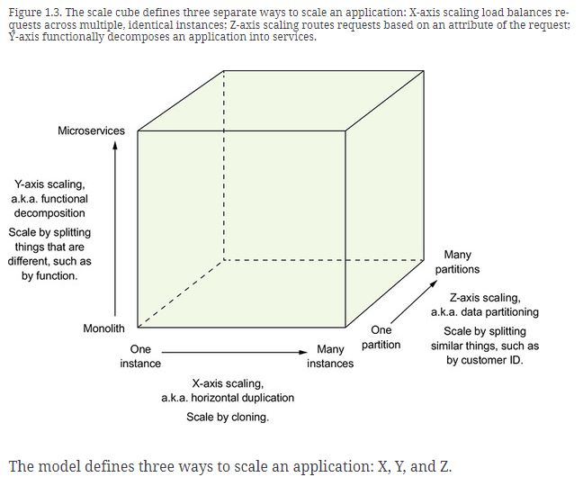
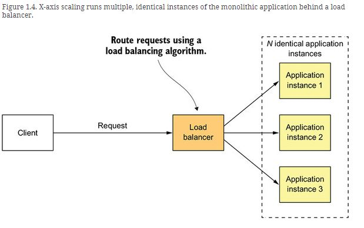
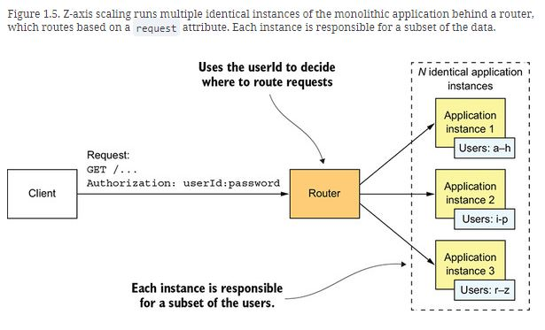
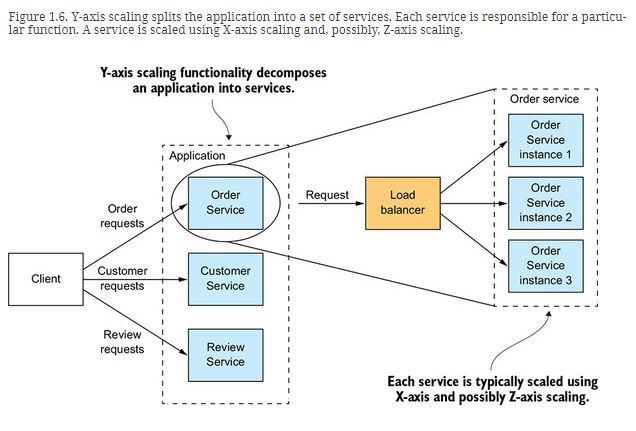
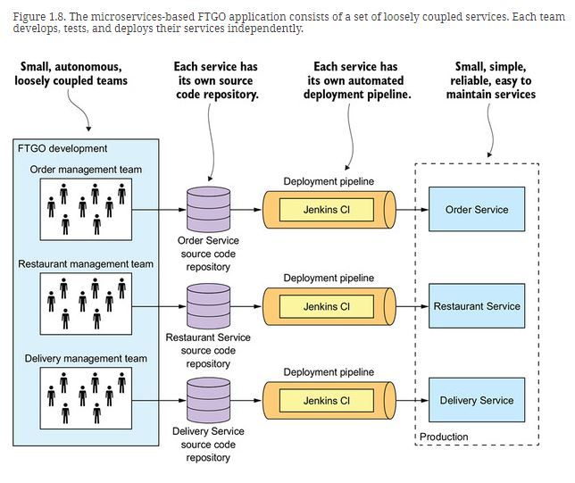

# 1. Scale cube and microservices
Definition of the microservice architecture is inspired by Martin Abbott and Michael Fisher’s excellent book, The Art of Scalability (Addison-Wesley, 2015). This book describes a useful, three-dimensional scalability model: the scale cube, shown in figure 1.3.

### X-AXIS SCALING LOAD BALANCES REQUESTS ACROSS MULTIPLE INSTANCES

X-axis scaling is a common way to scale a monolithic application. Figure 1.4 shows how X-axis scaling works. You run multiple instances of the application behind a load balancer. The load balancer distributes requests among the N identical instances of the application. This is a great way of improving the capacity and availability of an application.

### Z-AXIS SCALING ROUTES REQUESTS BASED ON AN ATTRIBUTE OF THE REQUEST

Z-axis scaling also runs multiple instances of the monolith application, but unlike X-axis scaling, each instance is responsible for only a subset of the data. Figure 1.5 shows how Z-axis scaling works. The router in front of the instances uses a request attribute to route it to the appropriate instance. An application might, for example, route requests using userId.

### Y-AXIS SCALING FUNCTIONALLY DECOMPOSES AN APPLICATION INTO SERVICES

X- and Z-axis scaling improve the application’s capacity and availability. But neither approach solves the problem of increasing development and application complexity. To solve those, you need to apply Y-axis scaling, or functional decomposition. Figure 1.6 shows how Y-axis scaling works: by splitting a monolithic application into a set of services.

# 2. What are microservices?

The high-level definition of microservice architecture (microservices) is an architectural style that functionally decomposes an application into a set of services

# 3. Each service has its own database

A key characteristic of the microservice architecture is that the services are loosely coupled and communicate only via APIs. One way to achieve loose coupling is by each service having its own datastore.

At development time, developers can change a service’s schema without having to coordinate with developers working on other services. At runtime, the services are isolated from each other—for example, one service will never be blocked because another service holds a database lock.

# 4. Benefits and drawbacks of the microservice architecture

**The microservice architecture has the following benefits:**

**ENABLES THE CONTINUOUS DELIVERY AND DEPLOYMENT OF LARGE, COMPLEX APPLICATIONS**

There are three ways that the microservice architecture enables continuous delivery/deployment:

- **It has the testability required by continuous delivery/deployment**—Automated testing is a key practice of continuous delivery/deployment. Because each service in a microservice architecture is relatively small, automated tests are much easier to write and faster to execute. As a result, the application will have fewer bugs.
- **It has the deployability required by continuous delivery/deployment**—Each service can be deployed independently of other services. If the developers responsible for a service need to deploy a change that’s local to that service, they don’t need to coordinate with other developers. They can deploy their changes. As a result, it’s much easier to deploy changes frequently into production.
- **It enables development teams to be autonomous and loosely coupled**—You can structure the engineering organization as a collection of small (for example, two-pizza) teams. Each team is solely responsible for the development and deployment of one or more related services. As figure 1.8 shows, each team can develop, deploy, and scale their services independently of all the other teams. As a result, the development velocity is much higher.

**EACH SERVICE IS SMALL AND EASILY MAINTAINED**
- Another benefit of the microservice architecture is that each service is relatively small. The code is easier for a developer to understand. The small code base doesn’t slow down the IDE, making developers more productive. And each service typically starts a lot faster than a large monolith does, which also makes developers more productive and speeds up deployments.

**SERVICES ARE INDEPENDENTLY SCALABLE**
- Each service in a microservice architecture can be scaled independently of other services using X-axis cloning and Z-axis partitioning. Moreover, each service can be deployed on hardware that’s best suited to its resource requirements. This is quite different than when using a monolithic architecture, where components with wildly different resource requirements—for example, CPU-intensive vs. memory-intensive—must be deployed together.

**EASILY EXPERIMENT WITH AND ADOPT NEW TECHNOLOGIES**
- In principle, when developing a new service, the developers are free to pick whatever language and frameworks are best suited for that service. In many organizations, it makes sense to restrict the choices, but the key point is that you aren’t constrained by past decisions.
Moreover, because the services are small, rewriting them using better languages and technologies becomes practical. If the trial of a new technology fails, you can throw away that work without risking the entire project. This is quite different than when using a monolithic architecture, where your initial technology choices severely constrain your ability to use different languages and frameworks in the future.

**BETTER FAULT ISOLATION**
- The microservice architecture has better fault isolation. For example, a memory leak in one service only affects that service. Other services will continue to handle requests normally. In comparison, one misbehaving component of a monolithic architecture will bring down the entire system.

**Drawbacks and issues of the microservice architecture:**

**FINDING THE RIGHT SERVICES IS CHALLENGING**
- If you decompose a system incorrectly, you’ll build a distributed monolith, a system consisting of coupled services that must be deployed together. A distributed monolith has the drawbacks of both the monolithic architecture and the microservice architecture.

**DISTRIBUTED SYSTEMS ARE COMPLEX**
- which makes development, testing, and deployment difficult.
- A service must be designed to handle partial failure and deal with the remote service either being unavailable or exhibiting high latency.
- Each service has its own database, which makes it a challenge to implement transactions and queries that span services
- The microservice architecture also introduces significant operational complexity. Many more moving parts—multiple instances of different types of service—must be managed in production
- Writing automated tests that involve multiple services is challenging

**DEPLOYING FEATURES SPANNING MULTIPLE SERVICES NEEDS CAREFUL COORDINATION**
- Another challenge with using the microservice architecture is that deploying features that span multiple services requires careful coordination between the various development teams. You have to create a rollout plan that orders service deployments based on the dependencies between services

**DECIDING WHEN TO ADOPT IS DIFFICULT**
- Another issue with using the microservice architecture is deciding at what point during the lifecycle of the application you should use this architecture. When developing the first version of an application, you often don’t have the problems that this architecture solves. Moreover, using an elaborate, distributed architecture will slow down development. That can be a major dilemma for startups, where the biggest problem is usually how to rapidly evolve the business model and accompanying application. Using the microservice architecture makes it much more difficult to iterate rapidly. A startup should almost certainly begin with a monolithic application.
